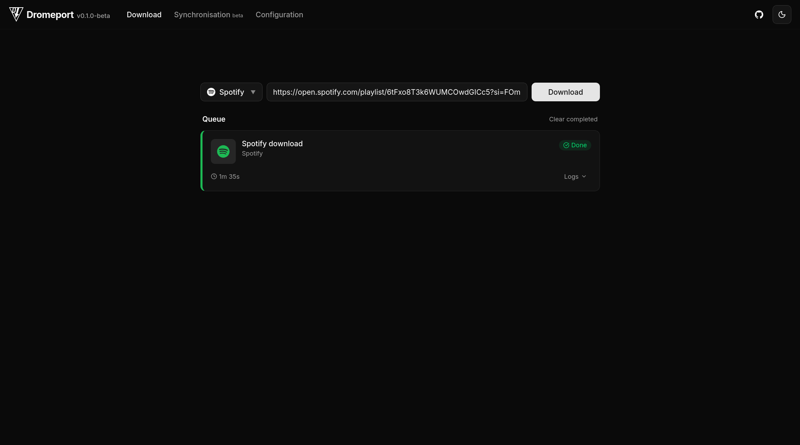
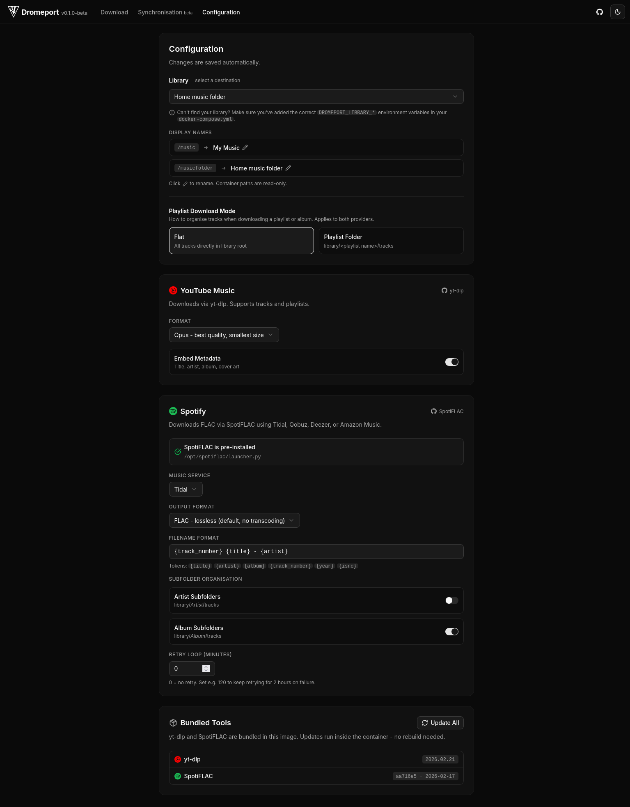
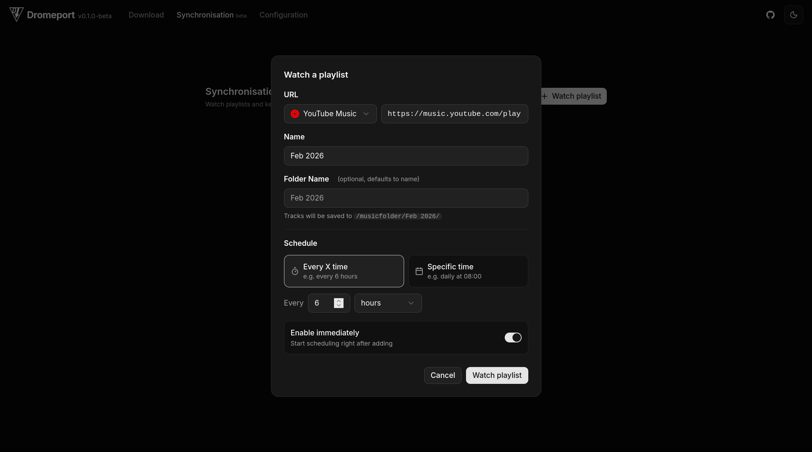

# Dromeport

A self-hosted music downloader built with [Navidrome](https://www.navidrome.org/) (or any other music server) in mind. It wraps yt-dlp and SpotiFLAC-CLI into a clean web UI. Both tools are bundled in the Docker image, so there's nothing to install manually.

> This software is in beta. If you run into anything, please report it at [github.com/sensor0x0/Dromeport/issues](https://github.com/sensor0x0/Dromeport/issues).

---

## Features

- Download tracks and playlists from YouTube Music via yt-dlp
- Download lossless FLAC from Spotify via SpotiFLAC (no account or subscription required)
- Automatically sync playlists from YouTube Music and Spotify using a task scheduler, set it to run on a schedule, at specific times, or every HH:MM interval
- Update yt-dlp and SpotiFLAC directly from the UI, no container rebuild needed
- Writes directly into your music library alongside Navidrome
- Live download log, per-download progress, and queue management

---

## Screenshots

Below is a quick overview of Dromeport’s interface. Click any thumbnail to view the full-size image.

<table width="100%">
  <tr>
    <td width="41%" align="center" valign="bottom">
      <a href="./docs/screenshots/download.png">
        
      </a>
    </td>
    <td width="18%" align="center" valign="bottom">
      <a href="./docs/screenshots/full_config.png">
        
      </a>
    </td>
    <td width="41%" align="center" valign="bottom">
      <a href="./docs/screenshots/watch_playlist.png">
        
      </a>
    </td>
  </tr>
  <tr>
    <td align="center"><strong>Home</strong></td>
    <td align="center"><strong>Configuration</strong></td>
    <td align="center"><strong>Playlist Sync</strong></td>
  </tr>
</table>

---

## Quick Start (Docker)

### 1. Add Dromeport to Navidrome's `docker-compose.yml`

Append the `dromeport` service to your existing file. Make sure your volume paths match the ones used by Navidrome, but without the `:ro` flag so Dromeport can write to them.
```yaml
services:
  navidrome:
    image: deluan/navidrome:latest
    user: 1000:1000
    ports:
      - "4533:4533"
    restart: unless-stopped
    volumes:
      - "/path/to/navidrome-data:/data"
      - "/path/to/Music:/music:ro"

  dromeport:
    image: ghcr.io/sensor0x0/dromeport:latest
    user: 1000:1000
    ports:
      - "8080:8080"
    restart: unless-stopped
    volumes:
      - "/path/to/Music:/music"        # same host path, writable
    environment:
      - DROMEPORT_LIBRARY_1=/music|My Music
      # Add more libraries as needed:
      # - DROMEPORT_LIBRARY_2=/another_library|Another Library
```

### 2. Start the stack
```bash
docker compose up -d
```

### 3. Open the web UI

Go to **http://localhost:8080** (or your server's IP).

---

## Configuration

All configuration happens in the web UI under the **Configuration** tab. Changes save automatically.

### Libraries

Libraries are defined by `DROMEPORT_LIBRARY_*` environment variables in your `docker-compose.yml`. Each one maps a container path to a display name shown in the UI.
````
DROMEPORT_LIBRARY_1=/music|My Music
DROMEPORT_LIBRARY_2=/john_music|John's Music
````

You can rename libraries in the UI without editing the compose file. The container path always stays as you mounted it.

> Can't see your library? Make sure the `DROMEPORT_LIBRARY_*` variable points to the exact container path in `volumes:`, then restart the container.

### Spotify / SpotiFLAC

SpotiFLAC-CLI is pre-installed and doesn't require an account, subscription, or API key.

### YouTube Music

yt-dlp is pre-installed and works out of the box. No account or API key required.

### Playlist Auto-Sync

You can set playlists from YouTube Music or Spotify to automatically sync on a schedule. The scheduler supports custom intervals, specific times, or recurring HH:MM settings.

---

## Updating yt-dlp and SpotiFLAC

Go to **Configuration → Bundled Tools** and click "Update All." Live output appears in the UI. No container restart or image rebuild needed.

---

## Adding a New Library

1. Add the host path to `volumes:` in `docker-compose.yml`
2. Add a matching `DROMEPORT_LIBRARY_*` environment variable
3. Restart the container: `docker compose up -d dromeport`

Example for adding a Podcasts library:
```yaml
volumes:
  - "/path/to/Podcasts:/podcasts"
environment:
  - DROMEPORT_LIBRARY_3=/podcasts|Podcasts
```

---

## Development / Setup without Docker (non-Navidrome use case)

### Prerequisites

- [Python 3.10+](https://www.python.org/downloads/)
- [Node.js 20+](https://nodejs.org/en/download)
- [yt-dlp](https://github.com/yt-dlp/yt-dlp) (`pip install yt-dlp`)
- [ffmpeg](https://www.ffmpeg.org/)
- [SpotiFLAC-CLI](https://github.com/jelte1/SpotiFLAC-Command-Line-Interface) (clone manually and set the path in Configuration)

### Backend
```bash
$ cd backend
$ python -m venv venv
$ source venv/bin/activate      # Windows: venv\Scripts\activate
$ pip install -r requirements.txt
$ python main.py
```

### Frontend
```bash
$ cd dromeport
$ npm install
$ npm run dev
```

App is available at **http://localhost:5173**. API calls are proxied to the backend on port 8080.

---

## Issues

Dromeport is currently in beta. If something breaks or doesn't work as expected, please open an issue at [github.com/sensor0x0/Dromeport/issues](https://github.com/sensor0x0/Dromeport/issues).

---

## License

GNU Affero General Public License v3.0